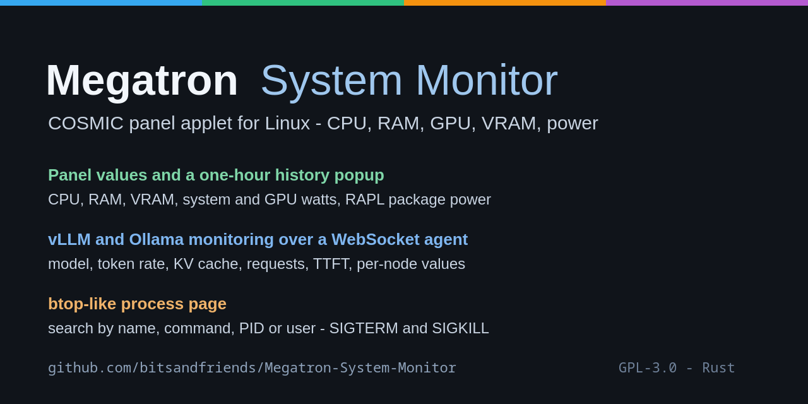

# Megatron System Monitor


**A COSMIC panel applet and system monitor for Linux that keeps CPU, RAM, GPU/VRAM
and power draw in the panel, opens a one-hour history popup on click, monitors a
vLLM or Ollama inference host over a lightweight WebSocket agent, and manages
processes (search, SIGTERM, SIGKILL) like a small btop inside the popup.**

It is a Rust application built on `libcosmic` for the COSMIC desktop, with no
telemetry, no cloud dependency and no external helper processes for the local
values: everything is read from `/proc` and `/sys`. Remote nodes run a single
0.6 MB agent that pushes one JSON document every two seconds and answers commands
on the same connection, so monitoring costs a fraction of a percent of one core.



## Features

**Panel and history**
- CPU, RAM, GPU VRAM and power (system watts and GPU watts) as five icon/value
  pairs in the COSMIC panel, with fixed field widths so the panel never twitches.
- Popup with exact values, a one-hour history at 1 Hz, and two charts
  (utilization and power draw) with now/average/min/max per series.

**Inference monitoring (vLLM and Ollama)**
- Loaded model, decode and prefill token rate, time to first token, KV-cache
  usage and trend, running and waiting requests, speculative-decoding acceptance,
  preemptions.
- Per-node CPU, RAM, swap, load, GPU utilization, GPU power and temperature.
- Automatic engine discovery on the usual ports, model lists per endpoint, and
  loading an Ollama model from the popup.
- One collapsible section per node; unavailable nodes keep their row with the
  reason instead of disappearing.

**Process page (btop-style)**
- Process list of the local machine and of every reachable node agent.
- Search by name, command line, PID or user; sorting by CPU, RAM, PID or name.
- SIGTERM and SIGKILL, both behind a confirmation dialog, with the exact effect
  named (SIGKILL warns that the process cannot clean up).

**Deployment**
- A node agent in Rust (static binary) with a Python fallback that speaks the
  same WebSocket protocol.
- Agent installation from the applet over SSH with a live log, or with
  `install-agent.sh` / `deploy-agents.sh` from the command line.
- Version check: the applet compares its shipped agent version with every node
  and offers an update.

## Quick start

```sh
# 1. Agent binaries (the applet installer embeds them, so build them first)
agent/build-agent.sh

# 2. Applet
./install.sh build
./install.sh install          # binary, icons, desktop entry and panel entry

# 3. Optional: make CPU package power readable (needs sudo)
./install.sh rapl-enable
```

Then open the applet in the panel. The system-monitor icon in the popup header
opens the process page, the cogwheel opens the settings.

## What the panel shows

| Icon | Value |
| --- | --- |
| CPU chip | CPU utilization in percent |
| RAM module | memory in percent |
| VRAM stack | GPU VRAM in percent |
| Lightning bolt | system power in watts (CPU package + GPUs) |
| GPU card | GPU power in watts |

## Popup contents

- Detail rows: CPU, RAM (used/total GiB and percent), GPU utilization, GPU VRAM,
  CPU package power, GPU power, system power.
- **Utilization · last hour** chart (CPU, RAM, VRAM, 0-100 %).
- **Power draw · last hour** chart (CPU package, GPU, dynamically scaled).
- **Collapsible inference section**: loaded model, token rate, time to first
  token, KV-cache usage and trend, running and waiting requests, speculative
  decoding, preemptions, per-node values, discovered engines with their models,
  and the established clients.
- **Process page**, see below.
- Settings page: node list, engine discovery, shared snapshot cache between
  several panel instances, chart visibility, agent versions and updates.

All value rows are left-labelled, right-aligned and connected by a leader line;
percentages and watts are padded with dimmed leading zeros so values line up.

## Process page

The system-monitor icon in the popup header opens the process page. It lists the
processes of this machine and of every reachable node agent:

| Element | Effect |
| --- | --- |
| Host row | pick this machine (read directly from `/proc`) or a monitored node (asked over its agent, up to 400 rows sorted by CPU) |
| Search field | filters immediately by PID, name, full command line and user |
| Sorting | `CPU` (default), `RAM`, `PID` or `Name` |
| Process name | toggles the expanded row with the full command line, user, state and PPID |
| **Ende** | sends **SIGTERM** after a confirmation - the process can save and clean up |
| **Kill** | sends **SIGKILL** after a confirmation - immediate, the dialog says so explicitly |
| Refresh icon | asks a node again right away |

`CPU %` is the share of a **single core** (values above 100 % mean several
threads), `RAM MiB` is the resident set size. The first value after opening the
page is `0.0 %` for every process because a percentage needs two samples. Signals
only reach processes of the same user; anything else reports
`keine Berechtigung (EPERM)`. PID 1 and the applet's or agent's own process are
refused. Local scanning runs only while the page is visible, and a node agent
scans `/proc` only when it receives a `processes` request.

## Repository layout

| Path | Purpose |
| --- | --- |
| `src/main.rs` | applet: panel, popup, inference section, process page, messages |
| `src/sensors.rs` | local values: `/proc/stat`, `/proc/meminfo`, amdgpu sysfs, RAPL |
| `src/graph.rs` | canvas charts and min/average/max statistics |
| `src/procs.rs` | process list: local `/proc` scan, agent protocol, signals |
| `src/spark.rs` | WebSocket client per node, JSON parser, history, snapshot |
| `src/install.rs` | in-app agent installer (embeds the agent binaries) |
| `agent/rust/` | node agent: `/proc`, `nvidia-smi`, engine discovery, vLLM metrics |
| `agent/megatron_sysmon_agent.py` | Python fallback with an identical protocol |
| `agent/ws_probe.py` | standalone WebSocket probe (`--seconds`, `--processes`, `--kill`) |
| `install.sh` | build, install and register the applet in the panel |
| `res/` | icons and the desktop entry |

## Requirements

- Linux with a COSMIC desktop session (COSMIC 1.8; `libcosmic` is pinned to a
  specific revision in `Cargo.toml`).
- Rust stable for the applet and the agent (built and tested with 1.98).
- Docker only when cross-compiling the agent for `aarch64` from `x86_64`; on
  `aarch64` the agent builds natively.
- For local power values: an AMD GPU through `amdgpu` hwmon and, for CPU package
  power, a readable RAPL counter.

## Build and install

```sh
agent/build-agent.sh          # agent binaries (embedded by the applet installer)
./install.sh build            # cargo build --release
./install.sh install          # install into ~/.local and register in the panel
./install.sh status           # installation and RAPL state
./install.sh panel-remove     # remove the panel entry only
./install.sh uninstall        # remove everything install.sh created
```

`install.sh` restarts running applet instances, so a freshly installed binary is
active immediately.

## Node agent

```sh
agent/deploy-agents.sh install     # copy, install, start and probe over SSH
agent/deploy-agents.sh status      # unit state, port, cost, self test
agent/deploy-agents.sh probe       # WebSocket test only
agent/deploy-agents.sh uninstall   # stop and remove the agent

# on the node itself
sudo agent/install-agent.sh install
agent/install-agent.sh status
agent/install-agent.sh once        # one JSON snapshot on stdout
```

Override the example target list:

```sh
SYSMON_AGENT_HOSTS="node-01 node-02" agent/deploy-agents.sh install
```

The agent listens on port 8787 (dual stack). On SELinux-enforcing systems
`install-agent.sh` installs it as a **user service**, because a system service
without its own SELinux policy runs as `init_t` and may not connect to local
engine ports; everywhere else it uses a system service. The unit applies
`Nice=15`, `CPUWeight=10`, `IOWeight=10`, `IOSchedulingClass=idle` and
`MemoryMax=256M`, so monitoring never competes with the inference workload.

Without an attached client the agent does not build snapshots and does not read
`/proc`; the metric scrape and the GPU loop pause as well.

## Configuration

Evaluation order for the node list:

1. environment variable `SYSMON_SPARK_AGENTS="node-01:8787,node-02:8787"` (or
   `off` to disable remote monitoring),
2. `~/.config/cosmic-applet-sysmon/spark.json`,
3. built-in defaults.

```json
{
  "enabled": true,
  "agents": ["node-01:8787", "node-02:8787"],
  "token": ""
}
```

An agent can require a token (`--token <value>` in its `ExecStart`); the applet
then sends it as `?token=…` when `token` is set in the configuration file. There
is no authentication by default.

Diagnostic switches for development:

| Variable | Effect |
| --- | --- |
| `SYSMON_OPEN_POPUP=1` | open the popup shortly after start |
| `SYSMON_OPEN_SETTINGS=1` | show the settings page instead of the values |
| `SYSMON_OPEN_PROCS=1` | open the process page |
| `SYSMON_PROC_HOST=n` | preselect a host on the process page (1 = first node) |
| `SYSMON_PROC_QUERY=text` | prefill the process search |
| `SYSMON_PROC_CONFIRM=pid:signal` | show the confirmation dialog for one process |
| `SYSMON_PROC_KILL=pid:signal` | send one signal through the real code path |
| `SYSMON_SPARK_AGENTS=off` | disable remote monitoring |

## Data sources

| Value | Source | Note |
| --- | --- | --- |
| CPU utilization | `/proc/stat` (delta) | all cores |
| Memory | `/proc/meminfo` | `MemTotal` minus `MemAvailable` |
| GPU VRAM | `/sys/class/drm/cardN/device/mem_info_vram_{used,total}` | the GPU with the largest VRAM |
| GPU utilization | `/sys/class/drm/cardN/device/gpu_busy_percent` | |
| GPU power | amdgpu hwmon, `power1_average` / `power1_input` | sum of all AMD GPUs |
| CPU package power | RAPL `/sys/class/powercap/intel-rapl:0/energy_uj` | root-only until `install.sh rapl-enable` |
| Node CPU/RAM/swap/load | agent, `/proc/stat`, `/proc/meminfo`, `/proc/loadavg` | pushed over WebSocket |
| Node GPU percent/watts/°C | agent, `nvidia-smi --loop-ms=3000` | one long-running process per node |
| vLLM model, token rate, KV cache, requests, TTFT | agent, `vllm:*` metrics from `/metrics` | scraped on loopback |
| Ollama models | agent, `/api/tags` and `/api/ps` | |
| Processes | `/proc/<pid>/{stat,status,cmdline}` plus `/proc/stat` as denominator | local, or the agent's `processes` action |

CPU shares are computed without knowing the kernel's clock tick: the delta of a
process's `utime + stime` is divided by the delta of all CPU jiffies from
`/proc/stat` and multiplied by the core count, which yields the share of one
core. `guest`/`guest_nice` are excluded because they are already contained in
`user`/`nice`.

## Limits

- "System power" is the measured sum of the CPU package (RAPL) and all AMD GPUs,
  not the wall-plug draw of the power supply; mainboard, drives and fans are not
  measurable.
- Only AMD GPUs are read locally (`amdgpu`); NVIDIA values arrive from the node
  agent through `nvidia-smi`.
- The history lives in memory only and starts over after a restart.
- A node without its own metrics endpoint reports engine values as unavailable;
  in a tensor-parallel setup only the rank that serves `/metrics` has them.
- Process signals require the same user; foreign processes can be listed but not
  signalled. Node listings are capped at 400 rows.
- On a hardened systemd **user** service, Linux exposes the owners of foreign
  processes as the overflow uid (`nobody`) inside the user namespace. A node that
  reports the local hostname is therefore read locally by the applet.
- Not implemented: `nice`/`renice`, thread lists, open files per process.

## Language

The documentation, code comments and commit messages in this repository are
English. The panel UI labels are German, which is the language the applet was
written in; translating them is a separate change to the Rust sources.

## License

GPL-3.0-only, see [LICENSE](LICENSE).

## Keywords

COSMIC panel applet, libcosmic applet, Rust system monitor, Linux system monitor,
CPU RAM GPU monitor, VRAM monitor, power draw monitoring, RAPL package power,
amdgpu monitoring, NVIDIA GPU monitoring, vLLM monitoring, Ollama monitoring,
LLM inference dashboard, token rate, KV cache, process manager, btop alternative,
process viewer with search, SIGTERM, SIGKILL, WebSocket agent, Pop!_OS COSMIC,
performance monitoring, homelab monitoring.
